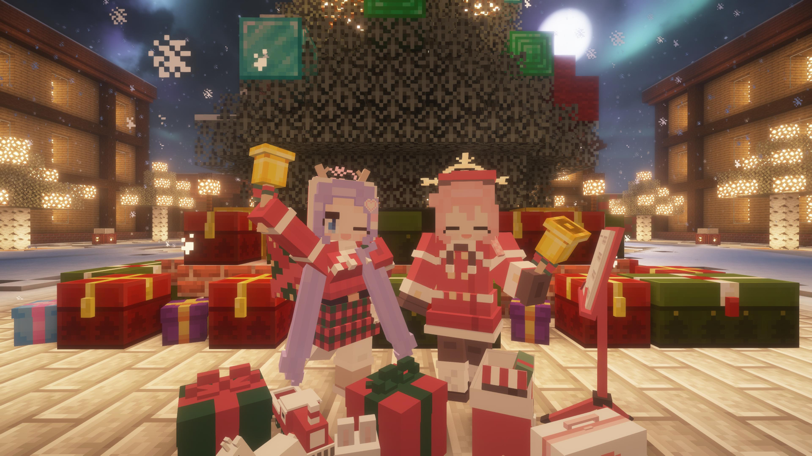

# FBAC_PhotoTakingAvatar

この[Figura](https://modrinth.com/mod/figura)アバターは[Figura Blue Archive Crafters（FBAC）](https://github.com/Gakuto1112/FiguraBlueArchiveCrafters)で写真を撮影するための補助アバターです。

ターゲットFiguraバージョン ... [0.1.5b](https://modrinth.com/mod/figura/version/0.1.5b+1.21.4)\
ターゲットMinecraftバージョン ... 1.21.4

## 作例




## 使い方

1. `src/`配下のファイル/ディレクトリ群は[Figuraアバターの形式](https://docs.figuramc.org/start_here/Avatar%20File%20Format)になっています。
  これらのファイル/ディレクトリをFiguraのアバターディレクトリ配下(通常は`${マインクラフトのゲームインスタンスディレクトリ}/figura/avatars/`)に新しいディレクトリを作成し、その配下に移動することで、Figuraにアバターとして認識されます。

  ```text
  ${マインクラフトのゲームインスタンスディレクトリ}
  ├ 📂 figura
  │ ├ 📂 avatars
  │ │ ├ 📂 FBACPhotoTakingAvatar ← **このディレクトリを作成する。名前は何でも良い。**
  | | | ├ 📁 models ← **以下`src/`内のファイル/ディレクトリをコピー**
  | | | ├ 📁 scripts
  | | | ├ 📁 textures
  | | | └ 📄 avatar.json
  | | ├ 📁 ${他のアバター1}
  | | ├ 📁 ${他のアバター2}
  | | └ ...
  │ ├ 📁 cache
  │ ├ 📁 config
  | └ ...
  ├ 📁 saves
  ├ 📁 resourcepacks
  └ ...
  ```

  （📁📁：ディレクトリ、📄：ファイル）

2. [`src/models/main.bbmodel`](https://github.com/Gakuto1112/FBAC_PhotoTakingAvatar/blob/main/src/models/main.bbmodel)を[BlockBench](https://www.blockbench.net)で開きます。
  モデルファイルには`World`のモデルグループがあるため、その中にキャラクターのモデルグループを入れていきます。

   

   - 別のタブでFBACアバターの`main.bbmodel`を開いたうえで、FBAC_PhotoTakingAvatar側の`main.bbmodel`にタブを戻した状態で、「File」→「読み込み」→「オープンプロジェクトの読み込み」→「main（FBACアバターのもの）」を選択すると、FBAC_PhotoTakingAvatar側の`main.bbmodel`に簡単にFBACアバターをインポートできます。
   その後、FBACのアバターのモデルグループ（`Avatar`という名前になっているはずです）をドラッグして`World`配下に移動させます。
   - インポートしたモデルのグループ名が`Avatar`のままだとわかりにくいので、キャラクターの名前など、わかりやすいものに変えておきます。
   - インポートしたFBACアバターのテクスチャファイルはFBAC_PhotoTakingAvatar側で別途保存しておくことをお勧めします。
     [`src/textures`](https://github.com/Gakuto1112/FBAC_PhotoTakingAvatar/tree/main/src/textures)に専用の保存ディレクトリを用意してあります。
     なお、BlockBenchでは同名の名前のテクスチャファイルの共存は許容していないため、`${オリジナル名}_${キャラクター名}.png`など、複数人キャラクターをインポートしてもテクスチャファイル名が重複しないように名付けます。
   - アバターをインポートした際にアバターモデルとは関係のないモデルグループ（`CameraAnchor`）やアニメーションもインポートされます。
     これはFBACアバターを動作させるために必要なものですが、キャラクターモデルだけを使用する場合には不要なので削除しても構いません。

3. インポートしたアバターに自由なポージングをさせたり、表情を変えたりしましょう。

   

4. マインクラフトのゲーム内で、撮影を行いたい場所に移動して、その座標を控えておきます。

   \
   （画像では[Better F3](https://modrinth.com/mod/betterf3)を使用しています。）

5. [`src/scripts/avatar.lua`](https://github.com/Gakuto1112/FBAC_PhotoTakingAvatar/blob/main/src/scripts/avatar.lua)をメモ帳などで開き、`BASE_POS`と書かれた行を探してください（始めのほうにあります）。
   ここを手順4で控えたワールド座標に置き換えます。
   `vectors.vec3(${X座標}, ${Y座標}, ${Z座標})`と置き換えてください。
   - 正確に控えたブロックの中心に配置したい場合は、X座標とZ座標をそれぞれ`0.5`加えた値を指定してください。

6. あとは自分自身が動いていい感じの場所を探して、スクリーンショットを撮影してください。
