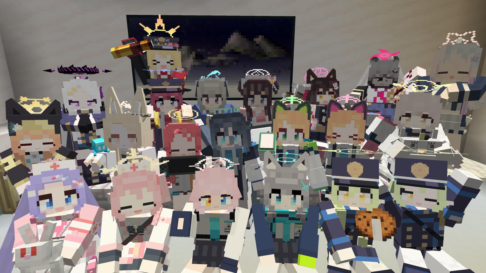
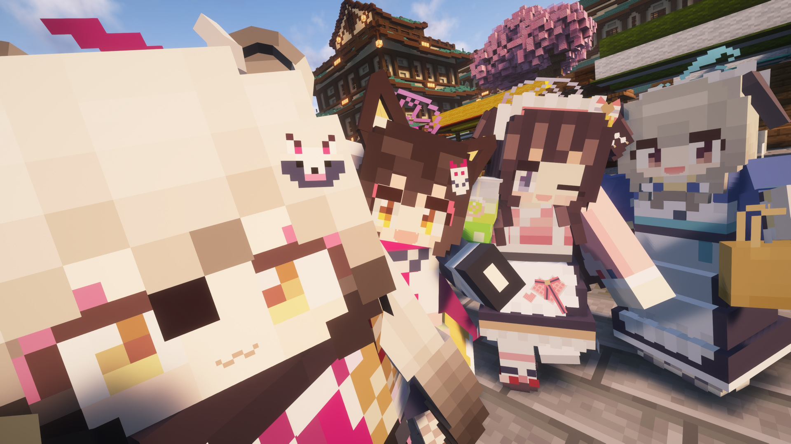
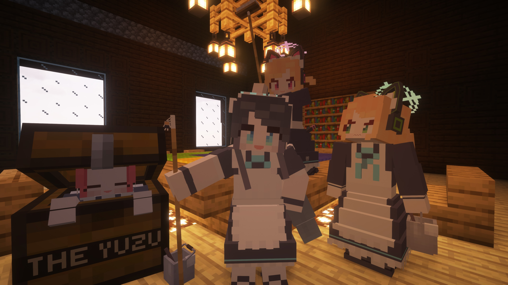
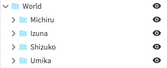
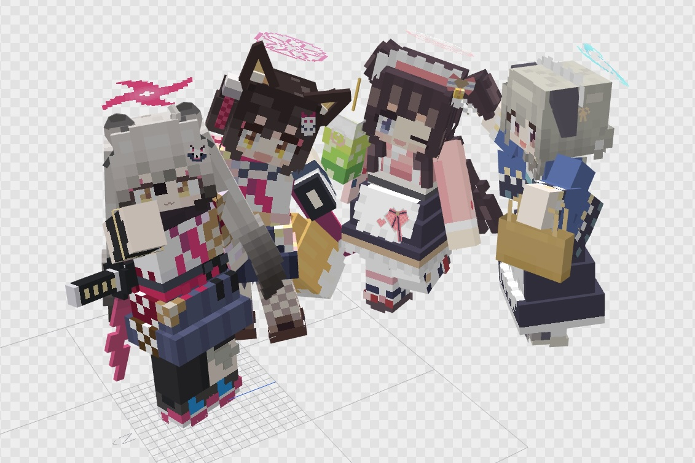
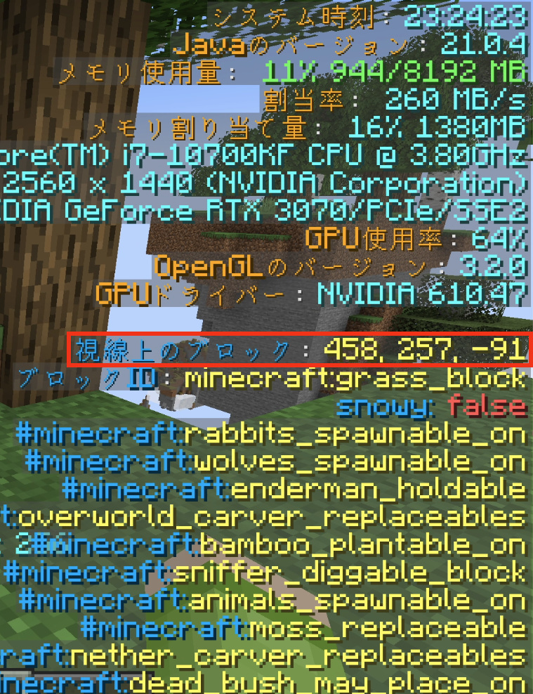

# FBAC_PhotoTakingAvatar

この[Figura](https://modrinth.com/mod/figura)アバターは[Figura Blue Archive Crafters（FBAC）](https://github.com/Gakuto1112/FiguraBlueArchiveCrafters)で写真を撮影するための補助アバターです。

ターゲットFiguraバージョン ... [0.1.5b](https://modrinth.com/mod/figura/version/0.1.5b+1.21.4)\
ターゲットMinecraftバージョン ... 1.21.4

## 作例








## ヘルパーアバターでできること

このヘルパーアバターを使用して写真撮影するにあたり、以下の恩恵を受けられます。

- FBACキャラクターをワールド上の任意の位置に固定可能。
  - プレイヤー自身がカメラマンとなって、自由な位置から写真撮影ができます。
- FBACキャラクターに元々付いていた頭や四肢のプレイヤーキャラクター連動を無効化します。
  - プレイヤーが動いてもFBACキャラクターが奇妙にジタバタすることがない、ということです。
- FBACキャラクター自体やヘイローのライティング処理を自動化します。
- 撮影時に便利な分割線（縦横それぞれ3分割）が表示されます。
  - F1キーでUIを消すと一緒に隠れます。
  - 分割線を増減させたい場合は、[`src/scripts/screen_split_line.lua`](./src/scripts/screen_split_line.lua)内の`X_COUNT`および`Y_COUNT`を変更してください。

## 使い方

1. `src/`配下のファイル/ディレクトリ群は[Figuraアバターの形式](https://docs.figuramc.org/start_here/Avatar%20File%20Format)になっています。
  これらのファイル/ディレクトリをFiguraのアバターディレクトリ配下(通常は`${マインクラフトのゲームインスタンスディレクトリ}/figura/avatars/`)に新しいディレクトリを作成し、その配下に移動することで、Figuraにアバターとして認識されます。

  ```text
  ${マインクラフトのゲームインスタンスディレクトリ}
  ├ 📂 figura
  │ ├ 📂 avatars
  │ │ ├ 📂 FBACPhotoTakingAvatar ← **このディレクトリを作成する。名前は何でも良い。**
  | | | ├ 📁 models ← **以下`src/`内のファイル/ディレクトリをコピー**
  | | | ├ 📁 scripts
  | | | ├ 📁 textures
  | | | └ 📄 avatar.json
  | | ├ 📁 ${他のアバター1}
  | | ├ 📁 ${他のアバター2}
  | | └ ...
  │ ├ 📁 cache
  │ ├ 📁 config
  | └ ...
  ├ 📁 saves
  ├ 📁 resourcepacks
  └ ...
  ```

  （📁📁：ディレクトリ、📄：ファイル）

2. [`src/models/main.bbmodel`](./src/models/main.bbmodel)を[BlockBench](https://www.blockbench.net)で開きます。
  モデルファイルには`World`のモデルグループがあるため、その中にキャラクターのモデルグループを入れていきます。

   

   - 別のタブでFBACアバターの`main.bbmodel`を開いたうえで、FBAC_PhotoTakingAvatar側の`main.bbmodel`にタブを戻した状態で、「File」→「読み込み」→「オープンプロジェクトの読み込み」→「main（FBACアバターのもの）」を選択すると、FBAC_PhotoTakingAvatar側の`main.bbmodel`に簡単にFBACアバターをインポートできます。
   その後、FBACのアバターのモデルグループ（`Avatar`という名前になっているはずです）をドラッグして`World`配下に移動させます。
   - インポートしたモデルのグループ名が`Avatar`のままだとわかりにくいので、キャラクターの名前など、わかりやすいものに変えておきます。
   - インポートしたFBACアバターのテクスチャファイルはFBAC_PhotoTakingAvatar側で別途保存しておくことをお勧めします。
     [`src/textures`](./src/textures/)に専用の保存ディレクトリを用意してあります。
     なお、BlockBenchでは同名の名前のテクスチャファイルの共存は許容していないため、`${オリジナル名}_${キャラクター名}.png`など、複数人キャラクターをインポートしてもテクスチャファイル名が重複しないように名付けます。
   - アバターをインポートした際にアバターモデルとは関係のないモデルグループ（`CameraAnchor`）やアニメーションもインポートされます。
     これはFBACアバターを動作させるために必要なものですが、キャラクターモデルだけを使用する場合には不要なので削除しても構いません。

3. インポートしたアバターに自由なポージングをさせたり、表情を変えたりしましょう。

   

4. マインクラフトのゲーム内で、撮影を行いたい場所に移動して、その座標を控えておきます。

   \
   （画像では[Better F3](https://modrinth.com/mod/betterf3)を使用しています。）

5. [`src/scripts/avatar.lua`](./src/scripts/avatar.lua)をメモ帳などで開き、`BASE_POS`と書かれた行を探してください（始めのほうにあります）。
   ここを手順4で控えたワールド座標に置き換えます。
   `vectors.vec3(${X座標}, ${Y座標}, ${Z座標})`と置き換えてください。
   - 正確に控えたブロックの中心に配置したい場合は、X座標とZ座標をそれぞれ`0.5`加えた値を指定してください。

6. あとは自分自身が動いていい感じの場所を探して、スクリーンショットを撮影してください。

## おすすめMOD

写真撮影をするにあたって使用をおすすめするMODのリストです。

紹介するMODは[Fabric](https://fabricmc.net)を使用する場合のものです。
[Forge](https://files.minecraftforge.net/net/minecraftforge/forge/)など、他のMODローダーを使用する場合は、適宜代替品のMODを使用してください。

| MOD名 | 説明 | URL |
| --- | --- | --- |
| Iris Shaders | いわゆる影MODです。日光や水面反射などをリアルにシミュレートし、マインクラフトの世界を、息を呑むぐらい美しくします。<br>シェーダーパックの使用にはそれなりのスペックのPCが必要ですが、写真は静止画なので、フレームレートが低くなってしまっても気にはなりません。 | <https://irisshaders.dev> |
| Complementary Shaders - Unbound | 実際にシェーダーを定義するパックの1つです。グラフィックが綺麗かつ自由にカスタマイズができるので特におすすめです。<br>なお、マインクラフトのバニラの雰囲気とバランスを取りたいなと感じる場合は[Complementary Shaders - Reimagined](https://modrinth.com/shader/complementary-reimagined)を使用してください。 | <https://modrinth.com/shader/complementary-unbound> |
| Fabrishot | ゲームのウィンドウサイズやモニターの解像度に関係なく4K画像や任意の解像度の画像のスクリーンショットを撮影できます。 | <https://modrinth.com/mod/fabrishot> |
| Freecam | プレイヤーの視点からカメラを外し、そのまま自由にカメラを動かせます。<br>写真の撮影位置を決めた後に、改めて俯瞰視点などから現場の様子を確認できます。 | <https://modrinth.com/mod/freecam> |

## トラブルシューティング

写真撮影中に困ったことが起きたら、まずはこちらを確認してください。

### モデルファイルが読み込まれない

Figura 0.1.5bまでは、BlockBench v4.12.6の形式のモデルファイルしか読み込めません（2026/06/13現在、最新バージョンはv5.1.4）。
このバージョンまでBlockBenchをダウングレードするか、レガシーなモデル形式で保存するようにしてください。

### 周りは明るいのにキャラクターだけ黒くなる

キャラクターの足元付近がフルブロックで埋まるとそのようになります。

[`src/scripts/avatar.lua`](./src/scripts/avatar.lua)内の`CHARACTER_LIGHTING_BASE_POINT_OFFSET`において、Y座標を上げる（〜1程度）と改善されます。

### ヘイローが上下にアニメーションしない

静止画の撮影を想定しているため、ヘイローが上下に浮遊するアニメーションは省略しています。

### 影MOD使用時に自分自身の影が邪魔になる

[`src/scripts/avatar.lua`](./src/scripts/avatar.lua)内の`onInit()`内に以下のコードを追加してください。

```lua
vanilla_model.PLAYER:setVisible(false)
```

これにより、バニラのプレイヤーモデルが非表示となり、自分自身の影ができることがなくなります。

## 注意事項

- このアバターが想定しているFigura 0.1.5bでは読み込めるBlockBenchのモデルフォーマットがv4.12.6までのものです。
  最新（v5.1.4）のモデルのフォーマットではFiguraが読み込めませんので、読み込めるバージョンまでBlockBenchをダウングレードさせるか、レガシーなモデル形式で保存するようにしてください。
- このアバターを使用して発生した、いかなる損害の責任も負いかねます。
- このアバターやFBACアバターを使用して撮影した写真の使い道は常識の範囲内で自由にしてもらっても構いませんが、[FBACのライセンス](https://github.com/Gakuto1112/FiguraBlueArchiveCrafters/blob/main/LICENSE)や[ブルーアーカイブの二次創作ガイドライン](https://bluearchive.jp/fankit/guidelines)を遵守するようにしてください。
- 不明点や不具合がありましたら、[Issues](https://github.com/Gakuto1112/FBAC_PhotoTakingAvatar/issues)や[Discussions](https://github.com/Gakuto1112/FBAC_PhotoTakingAvatar/discussions)やまでご連絡下さい。
